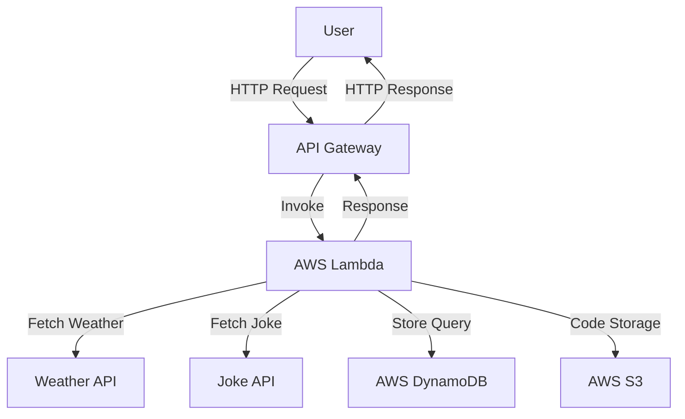

# Chatbot API

This is an AWS Lambda-based chatbot that fetches weather data and tells jokes using API Gateway.

## 🚀 Features
- Fetches **current weather** using OpenWeather API 🌤️
- Returns a **random joke** from an external joke API 😂
- Logs all interactions in **AWS DynamoDB** 📝


## 🏗️ System Architecture
This chatbot system is built using AWS services and follows the architecture below:

1. **API Gateway**: Handles incoming HTTP requests and routes them to Lambda.
2. **AWS Lambda**: Processes user queries, fetches data from external APIs, and interacts with DynamoDB.
3. **DynamoDB**: Stores chatbot interaction logs and user queries.
4. **AWS S3**: Stores the chatbot's Lambda function code.
5. **AWS CloudFormation**: Automates the deployment and management of all AWS resources.

### **Architecture Diagram**


## 🛠️ Setup Instructions

### **1. Install Dependencies**
Ensure you have Python installed, then install required dependencies from `requirement.txt`:
```sh
pip install -r requirement.txt -t .
```

### **2. Create Source Code Zip File**
Run the following command in PowerShell to package the source code:
```sh
Compress-Archive -Path * -DestinationPath chatbot_lambda.zip
```

### **3. Upload source code to AWS S3 and configure API Key**
3.1. Create and upload the zip file to an S3 bucket `chatbot-code-bucket`:
```sh
aws s3 mb s3://chatbot-code-bucket
```
```sh
aws s3 cp chatbot_lambda.zip s3://chatbot-code-bucket/
```
3.2. Create parameter store `/chatbot/weatherApiKey` and add Your Weather API KEY (Created from https://openweathermap.org/api):
```sh
aws ssm put-parameter --name "/chatbot/weatherApiKey" --value "YOUR_WEATHER_API_KEY" --type "String" --overwrite
```

### **4. Deploy with AWS CloudFormation**
Create an AWS CloudFormation stack using the provided template:
```sh
aws cloudformation create-stack --stack-name chatbot-stack --template-body file://cloud-formation-chat-bot.yaml --capabilities CAPABILITY_NAMED_IAM
```

## **API Deployment**
This chatbot is deployed using **AWS API Gateway**:
- API Gateway is configured for **POST** requests
- The Lambda function is integrated with API Gateway
- API information:
    + Invoke URL: Created API gateway id -> stage -> Invoke URL
    + Method: POST

## **Usage**
#### **1. Example Request**
```sh
curl --location --request POST 'your_invoke_url/chatbot' \
--header 'Content-Type: application/json' \
--data '{
    "query": "tell me a joke"
}'
```

#### **Example Response**
```json
{
    "response": "Why did the scarecrow win an award? Because he was outstanding in his field!"
}
```

#### **2. Example Request**
```sh
curl --location --request POST 'your_invoke_url/chatbot' \
--header 'Content-Type: application/json' \
--data '{
    "query": "what is the weather in London"
}'
```

#### **Example Response**
```json
{
    "response": "Current weather in london: broken clouds, 0.58°C."
}
```

## **🐞 Debugging**
- Check **CloudWatch logs** for Lambda execution errors.
- Verify **API Gateway method integration** (should be `POST`).

## 📜 License
This project is open-source and available under the MIT License.

---
Made by Sky